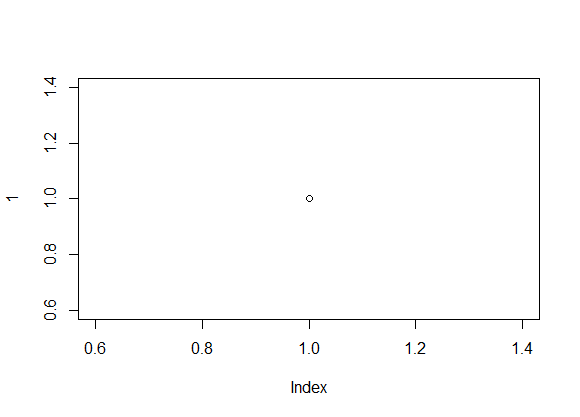

```{r pacotes, include=FALSE}
if (!require("vegan")) install.packages("vegan")
if (!require("knitr")) install.packages("knitr")

```

---
# Filiação

# Resumo

# Introdução

Primeira frase

~~Eu~~ **preciso** de *férias*

~<3~ ^<3^ ~<3~ ^<3^ ~<3~ ^<3^ ~<3~ ^<3^



# M&M's

- Item 1
  - Item 1.1

+ Item 3

1. Item 4
  - Item não sei o número

## Coleta de dados

## Análise de dados

```{r, echo=FALSE, eval=TRUE, results='asis'}
data("mtcars")

summary (lm(mpg ~ carb, mtcars))

```


# Resultados

Tabela 1. Modelos de carros antigos e suas características

A tabela "mtcars" tem `r ncol(mtcars)` colunas.

```{r, echo=FALSE, eval=FALSE}
nrow(mtcars)
ncol(mtcars)
```

```{r, echo=FALSE}
data("mtcars")
kable(mtcars)

```


A cerquinha abaixo não mostra o código, nem o seu resultado.

```{r cerquinha do plot, echo=FALSE, eval=FALSE}
plot(1)
```

A cerquinha abaixo mostra o código, mas não seu resultado.

```{r, echo=TRUE, eval=FALSE}
plot(1)

```

A cerquinha abaixo mostra o código e seu resultado.

```{r, echo=TRUE, eval=TRUE,}
plot(1)

```

A cerquinha abaixo não mostra o código, mas sim seu resultado.
```{r, echo=FALSE, eval=TRUE}
plot(1)

```


# Discussão

Estou citando fulano [@Araujo2012]

Segundo @Parmesan2006, isso pode acontecer.

Estou várias pessoas que fizeram isso [*i.e.* @Kramer-Schadt2013; @Atwater2018]

```{r, echo=FALSE, eval=TRUE, fig.cap="Meu plot"}
plot(1)

```


# Referências